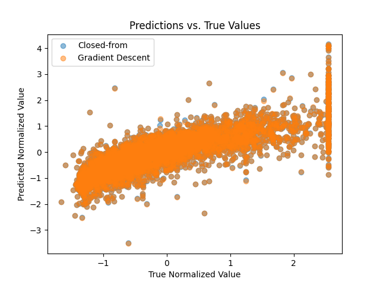
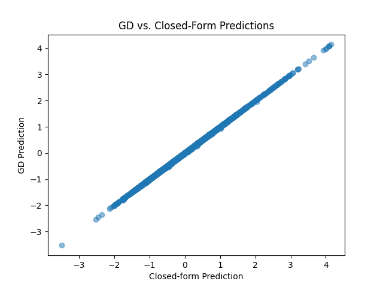
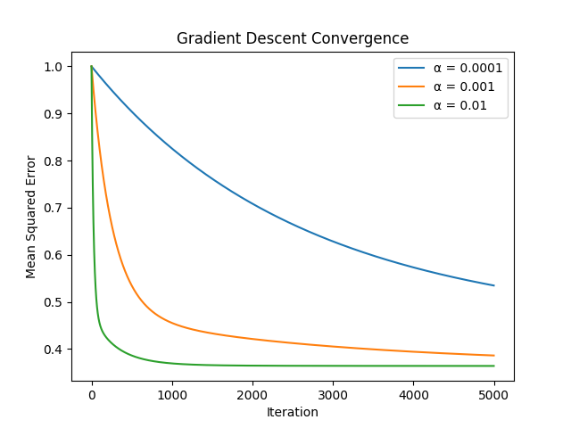

# California Housing Price Prediction with Multiple Linear Regression

This project implements multiple linear regression to predict median house values in California using the California Housing Prices dataset. It includes manual implementations of the closed-form solution and gradient descent, as well as a comparison with scikit-learn's `LinearRegression` model.

## Table of Contents
- [Overview](#overview)
- [Dataset](#dataset)
- [Features Used](#features-used)
- [Methodology](#methodology)
  - [1. Data Ingestion](#1-data-ingestion)
  - [2. Preprocessing](#2-preprocessing)
  - [3. Feature Scaling](#3-feature-scaling)
  - [4. Model Implementation](#4-model-implementation)
  - [5. Evaluation](#5-evaluation)
- [Visualizations](#visualizations)
- [Requirements](#requirements)
- [How to Run](#how-to-run)
- [Results](#results)

## Overview

The primary goal of this project is to build and evaluate linear regression models for predicting housing prices. It serves as an educational exercise to understand the underlying mathematics of linear regression by implementing it from scratch and comparing its performance against a standard library implementation.

## Dataset

The project uses the "California Housing Prices" dataset. Each row represents a block group in California, and the target variable is the median house value for that block.

**Data Source:**
The dataset was obtained from Kaggle:
[California Housing Prices on Kaggle](https://www.kaggle.com/datasets/camnugent/california-housing-prices/data)

The `housing.csv` file, as used by the script, is expected to be located at `data/housing.csv` relative to `learn.py`.

## Features Used

The following features are used for prediction:
1.  `longitude`: A measure of how far west a house is.
2.  `latitude`: A measure of how far north a house is.
3.  `housing_median_age`: Median age of a house within a block.
4.  `total_rooms`: Total number of rooms among all houses within a block.
5.  `total_bedrooms`: Total number of bedrooms among all houses within a block.
6.  `population`: Total number of people residing within a block.
7.  `households`: Total number of households for a block.
8.  `median_income`: Median income for households within a block (in tens of thousands of US Dollars).

**Target Variable:**
*   `median_house_value`: Median house value for households within a block (in US Dollars).

*Note: The `ocean_proximity` categorical feature was not included in this version of the model.*

## Methodology

The script follows these key steps:

### 1. Data Ingestion
- Loads the dataset from `data/housing.csv` using pandas.

### 2. Preprocessing
- **Missing Values:** Rows with any missing values are dropped using `df.dropna()`.
- **Feature Selection:** Numerical features listed above are selected for the model.

### 3. Feature Scaling
- **Input Features (X):** Standardized using `sklearn.preprocessing.StandardScaler` (Z-score normalization). This is applied after splitting the data to prevent data leakage (fit on training data, transform both training and test data).
- **Target Variable (y):** For the manual model implementations, the target variable (`median_house_value`) is scaled (Z-score normalization) using the mean and standard deviation of the *training* target values. Predictions are then unscaled back to the original dollar amount for evaluation. The scikit-learn model handles target scaling internally or works directly with unscaled targets.

### 4. Model Implementation
The data is split into 80% training and 20% testing sets. Three linear regression approaches are implemented:

#### a. Manual Closed-Form Solution
- Implements the normal equation: `theta = (X_b.T @ X_b)^-1 @ X_b.T @ y`
- `X_b` is the input feature matrix with an added bias column (intercept term).
- Trained on scaled input features and scaled target variable.

#### b. Manual Gradient Descent
- Implements batch gradient descent to find the optimal `theta` (weights).
- The cost function is Mean Squared Error (MSE).
- `theta` is updated iteratively: `theta = theta - alpha * gradient`
- Trained on scaled input features and scaled target variable.
- Hyperparameters: `alpha` (learning rate), `iterations`.

#### c. Scikit-learn Linear Regression
- Uses `sklearn.linear_model.LinearRegression`.
- Trained on scaled input features and the *original* unscaled target variable.

### 5. Evaluation
- **Metric:** Mean Squared Error (MSE) is used to evaluate the performance of all three models on the test set.
- Predictions from manual models (which were made on scaled data) are unscaled before MSE calculation to compare with scikit-learn's predictions and the true values.

## Visualizations

The script generates the following plots to analyze model performance and behavior:

1.  **Residual Distribution:** A histogram showing the distribution of residuals (actual - predicted values) for both the closed-form and gradient descent models.
    
    

2.  **Predictions vs. True Values:** Scatter plot comparing the predicted normalized house values against the true normalized house values for both manual models.

    

3.  **Gradient Descent vs. Closed-Form Predictions:** Scatter plot comparing the predictions made by the gradient descent model against those made by the closed-form model.
    
    

4.  **Gradient Descent Convergence:** A line plot showing the MSE (cost) over iterations for different learning rates (`alpha`) in the gradient descent algorithm.
    
    

## Requirements

- Python 3.x
- pandas
- numpy
- matplotlib
- scikit-learn

You can install these packages using pip:
```bash
pip install pandas numpy matplotlib scikit-learn
```

## How to Run

1.  Ensure you have the `housing.csv` file in a subdirectory named `data` (i.e., `data/housing.csv`) relative to `learn.py`.
2.  Make sure all required libraries are installed (see the Requirements section, which should be present earlier in the full document).
3.  Execute the Python script from your terminal. To do this, open your terminal or command prompt, navigate to the directory where `learn.py` is saved, and type:

    ```bash
    python learn.py
    ```
4.  The script will then print the following information to your console:
    *   Information about missing values (after the `dropna` operation).
    *   The content of the DataFrame (this might be a summary or truncated if the DataFrame is very large).
    *   The learned parameters (`theta` values) from the closed-form solution.
    *   The learned parameters (`theta` values) from the gradient descent algorithm.
    *   The Mean Squared Error (MSE) values for the closed-form model, the gradient descent model, and the scikit-learn model.
5.  After the console output, Matplotlib windows will pop up, each displaying one of the visualizations. You can save these images directly from the plot window (usually there's a save icon, or you can right-click) if you wish to include them in other reports.

## Results

The script will output the Mean Squared Error (MSE) for each of the three implemented linear regression models, evaluated on the test set.

-   **MSE (Closed-form):** `4921881237.628148`
-   **MSE (Gradient Descent):** `4920045313.821184`
-   **MSE (Scikit-learn):** `4921881237.628147`

These MSE values represent the average squared difference between the actual median house values and the values predicted by each model. A lower MSE generally indicates a model that fits the test data better. The results from your manual implementations (closed-form and gradient descent) should be very close to the scikit-learn model's MSE if they are implemented correctly and gradient descent has converged to a good solution.